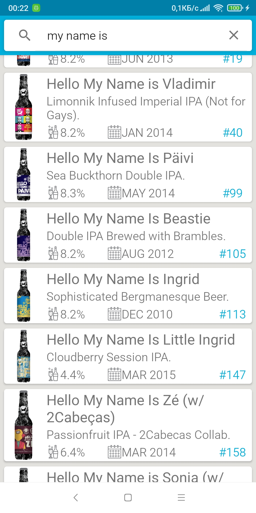

# Punk Paging

This Android application serves as a wrapper for the [Punk API](https://github.com/alxiw/punkapi), leveraging the [MVVM](https://developer.android.com/jetpack/guide#recommended-app-arch) and [Repository](https://developer.android.com/jetpack/guide#recommended-app-arch) design patterns. It incorporates several Android Architecture Components, including [ViewModel](https://developer.android.com/topic/libraries/architecture/viewmodel), [Room](https://developer.android.com/topic/libraries/architecture/room), and [Android Paging Library 3](https://developer.android.com/topic/libraries/architecture/paging/v3-overview), to optimize performance and user experience.

## Key Features
* *Data Fetching and Storage:* The app fetches beer data from the Punk API and stores it locally using a Room database.
* *Search Functionality:* Users can search for beers by name, providing a seamless and efficient search experience.
* *Optimized Performance:* The Android Paging Library 3 is employed to load data incrementally, ensuring smooth scrolling and efficient resource utilization.
* *Clean Architecture:* The MVVM architecture promotes code separation and maintainability, while the Repository pattern abstracts data access and simplifies data operations.

## Dependencies

* [Kotlin](https://github.com/JetBrains/kotlin) 2.0.21
* [Dagger](https://github.com/google/dagger) 2.52
* [Retrofit](https://github.com/square/retrofit) 2.11.0
* [Picasso](https://github.com/bumptech/glide) 2.71828
* [Kotlin Coroutines](https://github.com/Kotlin/kotlinx.coroutines) 1.9.0
* [Android Paging Library](https://developer.android.com/topic/libraries/architecture/paging/v3-overview) 3.3.5
* [Room](https://developer.android.com/topic/libraries/architecture/room) 2.6.1

## License

[MIT](LICENSE) © [alxiw](https://github.com/alxiw)
